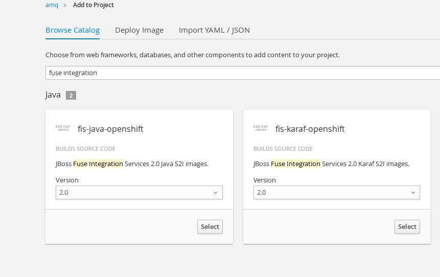

## Fuse Integration Service (FIS) and AMQ demo

### Introduction
This demo showcases FIS and AMQ deployments on Openshift container platform running a messaging workload.


### Pre-requisites
- A Openshift Container Platform that has the correct subscription entitlements to pull down Red Hat xPaaS images
- cluster-admin rights (for creating nodePorts)

Workstation with
- *oc* client installed
- Workstation running JBoss Developer Studio version 10 and java 8.

This Demo consist of 3 main components:

1. [Deploying AMQ xPaaS component](#deploying-amq).

  This acts a messaging gateway to receive messages from external clients.

2. [Deployng FIS component](#deploying-fis)

  This is the integration component in the demo, it pulls messages from AMQ, do some basic filtering and route messages back to AMQ based on payload.

2. [Running the Client](#client)

  work in progress...

### Deploying AMQ
There are 2 options on the deployment of AMQ, depending on how messages are sent to the AMQ instance.

Choose one of the deployment method.

- Sending messages to AMQ via the [OCP router](#sending-messages-via-ocp-router) (requires SSL setup)
- Sending messages via [nodePort](#sending-messages-via-nodeport) (requires cluster-admin rights but is more straightforward)


##### Sending messages via OCP router
To connect externally to AMQ instance via the OCP router, a SNI connection is required.

**Setting up SSL certs using Java Keytool**

```
# keytool -genkeypair -alias broker -keyalg RSA -keystore server.keystore -storepass password --dname "CN=wohshon,OU=ASEAN,O=redhat.com,L=Shenton Way ,S=SG,C=SG"


//Export the certificate so that it can be shared with clients:
$ keytool -export -alias broker -keystore server.keystore  -file broker_cert

//Create a client trust store that imports the broker certificate:
keytool -import -alias broker -keystore client.ts -file broker_cert

```
This client.ts file will be your client truststore

**OCP deployment**

- Create a new project

```
  # oc new-project xpaas-amq --display-name="AMQ Demo"

```

- Create Service Account and grant them the correct privileges

```

# echo '{"kind": "ServiceAccount", "apiVersion": "v1", "metadata": {"name": "amq-service-account"}}' | oc create -f -

# oc policy add-role-to-user view system:serviceaccount:$(oc project -q):amq-service-account


```

- Create secret using the server.keystore and associate secret with Service Account

```

# oc secrets new amq-app-secret <path.to>/server.keystore

# oc secrets add sa/amq-service-account secret/amq-app-secret```

```

**Deploy AMQ image**

- Via Web Console

1. Click on `Add to Project` at the top banner of the web console.

2. On the service catalog page, search and select the image `amq63-ssl`

3.

| # | Field                 | Value          | Remarks       |
|---| ----------------------|:--------------:|:-------------:|
| 1 |APPLICATION_NAME       | broker         |               |
| 2 |MQ_PROTOCOL            | openwire,mqtt  |               |
| 3 |MQ_TOPICS / MQ_QUEUES  | e.g. demo.topic   | Optional      |
| 4 |MQ_USERNAME            | admin          |               |
| 5 |MQ_PASSWORD            | admin          |               |
| 6 |AMQ_SECRET             | amq-app-secret | refer to objects created previously |
| 7 |AMQ_TRUSTSTORE         | server.keystore| refer to objects created previously |
| 8 |AMQ_TRUSTSTORE_PASSWORD  | password       |               |
| 9 |AMQ_KEYSTORE         | server.keystore| refer to objects created previously |
| 10|AMQ_KEYSTORE_PASSWORD  | password       |               |
| 11|AMQ_MESH_DISCOVERY_TYPE| mesh           |               |
| 12|AMQ_STORAGE_USAGE_LIMIT| 1-2G           | 1-2G sufficient for demo use cases|
| 13|IMAGE_STREAM_NAMESPACE | openshift      |   default      |

4. Expose route (please edit service name according to your environment)

`# oc expose svc broker-amq-mqtt-ssl`

5. Edit route for SSL passthrough (please edit route name according to your environment)

`# oc edit routes broker-amq-tcp-ssl`

    spec:
      host: broker-amq-tcp-ssl-xpaas-amq.cloudapps.demo.com
      port:
        targetPort: 8883
      tls:
        **termination: passthrough**  
      to:
        kind: Service
        name: broker-amq-mqtt-ssl
        weight: 100
      wildcardPolicy: None


##### Sending messages via nodePort
To connect externally to AMQ instance via a nodePort, a user with cluster-admin rights is required

**OCP deployment**

- Create a new project

  `# oc new-project xpaas-amq --display-name="AMQ Demo"`


**Deploy AMQ image**

- Via Web Console


1. Click on `Add to Project` at the top banner of the web console.

2. On the service catalog page, search and select the image `amq63-basic`

4. Fill up the form and click on `create`

| # | Field                 | Value          | Remarks       |
|---| ----------------------|:--------------:|:-------------:|
| 1 |APPLICATION_NAME       | broker         |               |
| 2 |MQ_PROTOCOL            | openwire,mqtt  |               |
| 3 |MQ_TOPICS / MQ_QUEUES  | e.g. demo.topic   | Optional      |
| 4 |MQ_USERNAME            | admin          |               |
| 5 |MQ_PASSWORD            | admin          |               |
| 6 |AMQ_MESH_DISCOVERY_TYPE| mesh           |               |
| 8 |AMQ_STORAGE_USAGE_LIMIT| 1-2G           | 1-2G sufficient for demo use cases|
| 7 |IMAGE_STREAM_NAMESPACE | openshift      |   default      |


**Creating a nodePort**

1. Create a yaml file :

        apiVersion: v1
        kind: Service
        metadata:
          name: amq-mqtt-nodeport
          namespace: amq
          labels:
            application: broker
        spec:
          ports:
            - name: port-1
              protocol: TCP
              port: 1883
              targetPort: 1883
              nodePort: 30001
          selector:
            application: broker
          type: NodePort
          sessionAffinity: None


Ensure that the `selector` value points to the amq pod to be connected to.      

2. Create the nodePort service

    `oc create -f <file>.yml`


### Deploying FIS

This is the integration component, [Fuse Integration Service](https://access.redhat.com/documentation/en-us/red_hat_jboss_fuse/6.3/html-single/fuse_integration_services_2.0_for_openshift/), consist of a camel workload running in a spring boot runtime.

The camel project is hosted on [github](https://github.com/wohshon/fis-demo)

The camel project is wired to the AMQ instance deployed in the previous section.

**Note that the application name and project name of the AMQ instance must be specified as *broker* and *amq* respectively for the connection to work**

//TODO change to cluser.local dns hostname instead of using HOST:PORT

2 ways to deployed the project

- via s2i

1. Click on `Add to Project`, Search for `Fuse Integration` and select fuse-java-openshift



2. Enter the name (e.g. fis) and `https://github.com/wohshon/fis-demo` under *Git Repository URL* and click Create.

3. This will kick start the deployment of the FIS image

- via CLI

If you have maven configured correctly, you can use the deploy using the fabric8 plugin

1. Ensure you are login to OCP server, and in the correct namespace.

2. At the root of the camel project, run

  `# mvn fabric8:deploy`

2. It will take a whle for the binary deployment to complete.


### Client

//TODO - client app

1. Connecting to AMQ

- via route

endpoint: `https://<route>:443`

- via nodePort

endpoint: `http://<node ip of any node>:<exposed nodeport>`

#### Scenario 1 - echo message

FIS instance listens to the following destinations on the AMQ instance and will echo messages received on the AMQ console log.
- demo.queue.1 , over openwire
- test.mqtt.topic, over mqtt


#### Scenario 2 - Message routing

FIS instance listens to the following queue on the AMQ instance
- incoming.order.queue

It route incoming messages based on the `orderItemPublisherName` element, and route it to different queues on the AMQ.

Sample payload are :

    <order>
    <orderId>1</orderId>
    <orderItems>
    	<orderItemId>1</orderItemId>
    	<orderItemQty>1</orderItemQty>
    	<orderItemPublisherName>Orly</orderItemPublisherName>
    	<orderItemPrice>10.59</orderItemPrice>
    </orderItems>
    </order>


    <order>
    <orderId>2</orderId>
    <orderItems>
    	<orderItemId>2</orderItemId>
    	<orderItemQty>1</orderItemQty>
    	<orderItemPublisherName>ABC Company</orderItemPublisherName>
    	<orderItemPrice>15.59</orderItemPrice>
    </orderItems>
    </order>
